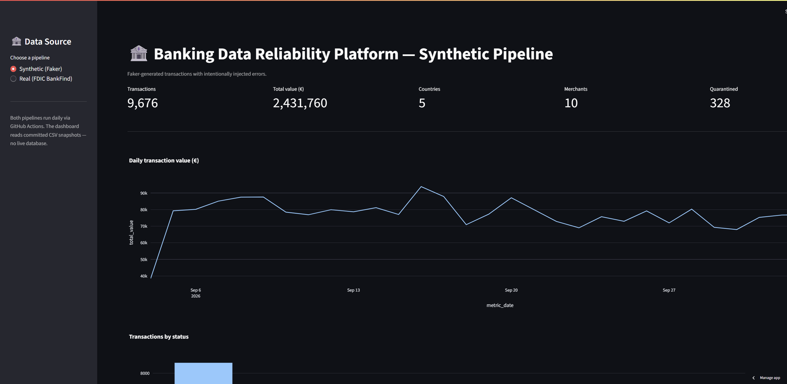
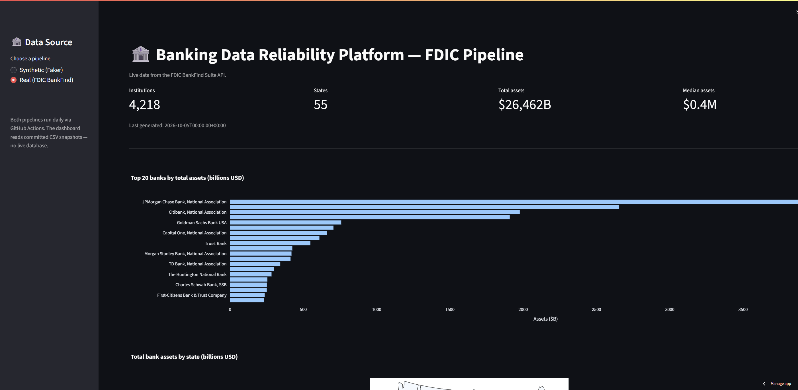

# 🏦 Banking Data Reliability Platform

> An Airflow-orchestrated dual-pipeline data platform that ingests synthetic **and live FDIC** banking data, validates it, quarantines bad records, models it with dbt, and exposes KPIs + pipeline-health metrics on a public Streamlit dashboard.

[](LICENSE)
[](https://www.python.org/downloads/release/python-3120/)
[](https://airflow.apache.org/)
[](https://www.getdbt.com/)
[](https://www.postgresql.org/)
[](https://docs.docker.com/compose/)
[](https://banking-reliability-platform.streamlit.app)

---

## 🌐 Live Dashboard

👉 **https://banking-reliability-platform.streamlit.app**

Toggle between two data sources in the sidebar:

- **Synthetic (Faker)** — generated transactions with intentionally injected errors
- **Real (FDIC BankFind)** — live data on ~4,200 US FDIC-insured banks

The dashboard reads committed CSV snapshots — no live database required. Both pipelines run daily via GitHub Actions and commit fresh snapshots back to the repo, which auto-redeploys the app.

### Synthetic Pipeline



### FDIC BankFind Pipeline



---

## 🎯 The Problem

A bank receives data every day from multiple systems: customers, accounts, cards, payments, transactions, merchants, branches. Simply *storing* the data is not the hard part.

The hard part is:

> **How does a bank automatically collect data from many sources, detect problems before they silently corrupt analytics, create reliable datasets, and publish trustworthy information for business decisions?**

This project demonstrates how to solve that problem, one maturity level at a time.

### A concrete example

Imagine one day 1,000,000 transactions arrive:

- 500 have missing customer IDs
- 100 are duplicates
- 25 refer to accounts that don't exist
- One source suddenly renamed a column

A naive pipeline loads everything and silently corrupts every downstream report.

A **reliable** pipeline detects those problems, prevents the bad rows from reaching the analytical layer, and reports what happened.

That is exactly what this platform does.

---

## 🗺️ Four Versions, Four Levels of Maturity

This project is not four separate projects — it's **one repository that evolves**.

- [x] **Version 1** — Basic reliable ETL pipeline
- [x] **Version 2** — Trusted data & analytical layer
- [x] **Version 3** — Production-style reliability platform
- [x] **Version 4** — Dual pipelines + live Streamlit deployment

### Version 1 — Basic Reliable ETL Pipeline

**Question answered:** *Can I build an automated end-to-end data pipeline?*

- Synthetic banking data (customers, accounts, transactions) generated with Faker
- Airflow DAG orchestrates generate → load → validate → transform
- PostgreSQL stores `raw`, `staging`, and `analytics` layers
- Basic data quality rules (positive amounts, referential integrity, unique IDs)
- Simple daily KPIs

### Version 2 — Trusted Data & Analytical Layer

**Question answered:** *Can I build a trustworthy analytical system?*

- **dbt** transformations with documented models and schema tests
- Dimensional model: `fact_transactions` + `dim_customer`, `dim_account`, `dim_date`
- `quarantine.transactions` table with a `reject_reason` for every rejected row
- dbt tests: uniqueness, not-null, accepted values, referential integrity (9/9 passing)
- Expanded business KPIs built from the star schema

### Version 3 — Production-Style Reliability Platform

**Question answered:** *Can I build a reliable production-style platform?*

- **Pipeline monitoring** — every run recorded in `ops.pipeline_runs` with duration, counts, and status
- **Reconciliation** — source-side totals compared against warehouse-side totals, with tolerance thresholds
- **Schema-drift detection** — compares raw table columns to the previous run's snapshot
- **Quality-check audit trail** — one row per check per run in `ops.quality_checks`
- **Retries with exponential backoff** on all tasks
- **Idempotent processing** — safe to re-run any date
- **Live Streamlit dashboard** showing KPIs, pipeline health, trends, and reconciliation

### Version 4 — Dual Pipelines + Live Streamlit Deployment

**Question answered:** *Can I operate a public, daily-updating data platform?*

- **Second pipeline** — `fdic_daily_etl` pulls live data from the FDIC BankFind Suite API (~4,200 US banks, ~$26T in assets)
- **GitHub Actions** — daily cron at 04:00 UTC runs both DAGs against a fresh Postgres service container
- **Snapshot publishing** — every run writes CSVs to `dashboard/data/{synthetic,fdic}/`
- **Bot commits** — the workflow commits fresh snapshots back to `main`
- **Streamlit Cloud** — public dashboard auto-redeploys on every push
- **Dual-source UI** — sidebar toggle switches between synthetic and FDIC views

---

## 🏗️ Architecture

```
                     ┌─────────────────────────────────────────┐
                     │  GitHub Actions (daily cron, 04:00 UTC) │
                     └────────────────────┬────────────────────┘
                                          │
              ┌───────────────────────────┴──────────────────────────┐
              ▼                                                      ▼
     Synthetic pipeline                                       FDIC pipeline
    (Faker + injected errors)                            (FDIC BankFind API)
              │                                                      │
              └──────────────────┬───────────────────────────────────┘
                                 ▼
                     PostgreSQL (raw → staging → analytics)
                                 │
                                 ▼
                   dbt models + tests + quality gates
                                 │
                                 ▼
                CSV snapshots → dashboard/data/{synthetic,fdic}/
                                 │
                                 ▼
                  Git commit + push to main (bot)
                                 │
                                 ▼
               Streamlit Cloud auto-redeploy → public app
```

### Synthetic DAG (`banking_daily_etl`) — 13 tasks

```
start_run → generate_synthetic_data → load_raw → validate_transform_load
         → quarantine_rejects → dbt_run → dbt_test → quality_check
         → reconciliation → schema_drift → compute_metrics
         → finish_run → publish_snapshot
```

### FDIC DAG (`fdic_daily_etl`) — 6 tasks

```
start_run → extract_fdic → validate_fdic → quality_check
         → finish_run → publish_snapshot
```

---

## 📊 Live Dashboard

| Panel | Content |
|---|---|
| **Sidebar toggle** | Switch between Synthetic and FDIC data sources |
| **KPI cards** | Transactions · Total value · Countries · Merchants · Quarantined |
| **Daily value trend** | Line chart of daily transaction value |
| **Transactions by status** | Bar chart of success / failed / pending |
| **Quarantine breakdown** | Bar chart by reject reason |
| **Pipeline health** | Last 30 runs with status, record counts, duration |
| **FDIC: top 20 banks** | Horizontal bar chart by assets |
| **FDIC: assets by state** | US choropleth map |
| **FDIC: all institutions** | Sortable table of ~4,200 banks |

---

## 🛠️ Tech Stack

| Layer | Technology |
|---|---|
| Orchestration | Apache Airflow 3.1.3 (LocalExecutor, Docker Compose) |
| Language | Python 3.12 |
| Database | PostgreSQL 16 |
| Data generation | Faker |
| External API | FDIC BankFind Suite (`https://api.fdic.gov/banks/`) |
| Transformations | pandas (V1) → dbt-core 1.9 (V2+) |
| Testing | dbt schema tests, pytest |
| Containerization | Docker Compose |
| Dashboard | Streamlit 1.46 + Plotly |
| CI/CD | GitHub Actions (daily cron + manual trigger) |
| Deployment | Streamlit Community Cloud |

---

## 📂 Project Structure

```
banking-data-reliability-platform/
├── dags/
│   ├── banking_daily_etl.py          # 13-task synthetic DAG
│   └── fdic_daily_etl.py             # 6-task FDIC DAG
├── src/
│   ├── extract/
│   │   └── fdic.py                   # FDIC BankFind API client
│   ├── generators/
│   │   └── synthetic_banking.py      # Faker-based generator with error injection
│   └── utils/
│       └── reliability.py            # Monitoring, reconciliation, drift helpers
├── dbt/
│   ├── dbt_project.yml
│   ├── profiles.yml
│   ├── macros/
│   │   └── generate_schema_name.sql
│   └── models/
│       ├── staging/                  # 3 staging views
│       └── marts/                    # 3 dims + 1 fact + 9 tests
├── sql/
│   ├── schema.sql                    # raw / staging / analytics
│   ├── quarantine.sql                # quarantine.transactions
│   └── ops.sql                       # ops.* monitoring tables
├── dashboard/
│   ├── app.py                        # Streamlit dual-source dashboard
│   ├── requirements.txt              # Slim deps for Streamlit Cloud
│   └── data/
│       ├── synthetic/                # Committed CSV snapshots
│       └── fdic/                     # Committed CSV snapshots
├── docs/
│   └── screenshots/                  # Dashboard screenshots for README
├── .github/workflows/
│   └── daily_pipeline.yml            # Runs both DAGs daily, commits snapshots
├── docker/
│   └── Dockerfile
├── docker-compose.yml
├── requirements.txt
├── .env.example
├── .gitignore
├── LICENSE
└── README.md
```

---

## 🚀 Running Locally

### Prerequisites

- Docker Desktop (with WSL 2 backend if on Windows)
- WSL 2 (Ubuntu) — or any Linux/macOS environment
- ~4 GB free RAM

### 1. Clone and configure

```bash
git clone https://github.com/AG-geodata-analyst/banking-data-reliability-platform.git
cd banking-data-reliability-platform

# Set your WSL user ID (avoids file permission issues)
echo "AIRFLOW_UID=$(id -u)" > .env
```

### 2. Build and initialize

```bash
docker compose build
docker compose up airflow-init
```

Wait for `airflow-init` to exit with code 0.

### 3. Start the stack

```bash
docker compose up -d
```

### 4. Open the UIs

| Service | URL | Credentials |
|---|---|---|
| Airflow | http://localhost:8081 | `admin` / `admin` |
| Streamlit (local) | http://localhost:8502 | — |
| Streamlit (public) | https://banking-reliability-platform.streamlit.app | — |

> If the Airflow login fails, check `config/simple_auth_manager_passwords.json.generated` — it should contain `{"admin": "admin"}`.

### 5. Run the pipelines

```bash
# Synthetic pipeline
docker compose exec airflow-scheduler airflow dags test banking_daily_etl $(date +%Y-%m-%d)

# FDIC pipeline (needs FDIC_API_KEY in env)
docker compose exec -e FDIC_API_KEY="your-key" airflow-scheduler \
  airflow dags test fdic_daily_etl $(date +%Y-%m-%d)
```

Expected final line for each:

```
DagRun Finished: dag_id=..., ... state=success
```

### 6. Stop everything

```bash
docker compose down          # stop (keeps data)
docker compose down -v       # stop + wipe database
```

---

## 🤖 Automation

The repo includes a GitHub Actions workflow at `.github/workflows/daily_pipeline.yml`.

**Trigger:**
- Scheduled — every day at 04:00 UTC
- Manual — Actions tab → Daily Banking Pipelines → Run workflow

**What it does:**
1. Spins up a fresh PostgreSQL 16 service container
2. Installs Airflow 3.1.3 + dbt-core + dependencies
3. Applies `sql/schema.sql`, `sql/quarantine.sql`, `sql/ops.sql`
4. Runs `banking_daily_etl` and `fdic_daily_etl`
5. Commits `dashboard/data/**` back to `main` as `github-actions[bot]`
6. Streamlit Cloud detects the push and auto-redeploys

**Required GitHub secret:** `FDIC_API_KEY` (get one at https://api.fdic.gov/banks/docs/)

---

## 🗄️ Data Model

### Schemas

| Schema | Purpose |
|---|---|
| `raw` | Data exactly as it arrived (all columns as TEXT) |
| `staging` | Typed, cleaned, validated data (dbt views) |
| `analytics` | Business-facing star schema and KPIs |
| `quarantine` | Rejected rows with a documented reason |
| `ops` | Pipeline metadata — runs, checks, reconciliation, schema snapshots |

### Tables

| Table | Layer | Purpose |
|---|---|---|
| `raw.customers` | Raw | Untyped landing zone |
| `raw.accounts` | Raw | Untyped landing zone |
| `raw.transactions` | Raw | Untyped landing zone |
| `staging.stg_customers` | Staging | Typed customer view |
| `staging.stg_accounts` | Staging | Typed accounts view |
| `staging.stg_transactions` | Staging | Typed, positive amounts only |
| `analytics.dim_customer` | Analytics | Customer dimension |
| `analytics.dim_account` | Analytics | Account dimension (joined to customer) |
| `analytics.dim_date` | Analytics | Date dimension (2024–2027) |
| `analytics.fact_transactions` | Analytics | One row per accepted transaction |
| `analytics.daily_transaction_metrics` | Analytics | Daily business KPIs |
| `quarantine.transactions` | Quarantine | Rejected rows with `reject_reason` |
| `ops.pipeline_runs` | Ops | One row per DAG run |
| `ops.quality_checks` | Ops | One row per check per run |
| `ops.reconciliation` | Ops | Source-vs-target metric comparisons |
| `ops.schema_snapshots` | Ops | Raw column snapshots per run |

---

## 🧪 Example Queries

```sql
-- Row counts across every layer
SELECT
    (SELECT COUNT(*) FROM raw.transactions)              AS raw_rows,
    (SELECT COUNT(*) FROM staging.stg_transactions)      AS staging_rows,
    (SELECT COUNT(*) FROM analytics.fact_transactions)   AS fact_rows,
    (SELECT COUNT(*) FROM quarantine.transactions)       AS quarantined_rows;

-- Daily KPIs
SELECT * FROM analytics.daily_transaction_metrics
ORDER BY metric_date DESC LIMIT 10;

-- Business rollup by country
SELECT
    dc.country,
    COUNT(*)                        AS txns,
    ROUND(SUM(ft.amount), 2)        AS total_value
FROM analytics.fact_transactions ft
LEFT JOIN analytics.dim_customer dc USING (customer_id)
GROUP BY dc.country
ORDER BY total_value DESC;

-- Pipeline health — last 5 runs
SELECT run_id, dag_id, started_at, status, records_extracted, duration_seconds
FROM ops.pipeline_runs
ORDER BY started_at DESC LIMIT 5;

-- Quarantine breakdown
SELECT reject_reason, COUNT(*)
FROM quarantine.transactions
GROUP BY reject_reason
ORDER BY 2 DESC;
```

---

## 🧠 Design Decisions

| Decision | Rationale |
|---|---|
| **Synthetic data with injected errors** | Demonstrates validation and quarantine logic without touching real customer data (GDPR) |
| **Real FDIC data as a second pipeline** | Proves the platform handles more than one source, with an actual external API and rate limits |
| **Five-layer schema** (`raw` / `staging` / `analytics` / `quarantine` / `ops`) | Mirrors a real data-warehouse design; each layer has a clear purpose |
| **Quarantine instead of deletion** | Bad rows should be investigated, not silently dropped |
| **dbt for transformations** | Declarative, testable, documented models; schema tests run in CI |
| **Committed CSV snapshots** | Decouples the dashboard from the database — Streamlit Cloud has no Postgres |
| **GitHub Actions + Streamlit Cloud** | Public, daily-updating, zero-infrastructure deployment |
| **Docker Compose** | Reproducible environment — anyone can run the project with one command |
| **Custom ports** (8081, 5433, 8502) | Allows this project to coexist with other local Airflow/Postgres instances |
| **Exponential-backoff retries** | Transient failures should not require manual intervention |
| **Idempotent processing** | Re-running the same date is always safe |
| **Repo-relative paths in DAGs** | Same DAG runs unchanged inside Docker and on the GitHub runner |

---

## 🛣️ Roadmap

- [x] **Scaffolding** — Docker Compose stack, ports, folder structure, README
- [x] **Version 1** — Basic reliable ETL pipeline
- [x] **Version 2** — dbt + data quality + dimensional model + BI
- [x] **Version 3** — Monitoring, reconciliation, schema drift, dashboard
- [x] **Version 4** — Dual pipelines + GitHub Actions + live Streamlit deployment
- [ ] **Future** — Alerting (Slack/email), Docker Hub image, cloud-managed Postgres

---

## 🧾 What a recruiter sees

> *"Built a production-style banking data platform with two Airflow pipelines (synthetic + live FDIC), dbt transformations, dimensional modeling, automated quality gates, reconciliation, schema-drift detection, a GitHub Actions daily cron, and a public Streamlit dashboard — all containerized with Docker Compose."*

---

## 📜 License

Released under the [MIT License](LICENSE).

```
Copyright (c) 2026 Anderson Isaac Guamán Viveros
```

You are free to use, modify, and distribute this software, provided the original copyright notice and this permission notice are included in all copies or substantial portions of the software.

---

## 🙋 About

**Anderson Isaac Guamán Viveros**

Background in GIScience, Earth Observation, and Environmental Modelling.
Currently focused on data engineering, data quality, and analytics engineering.

- GitHub: [@AG-geodata-analyst](https://github.com/AG-geodata-analyst)
- Related project: [Estonia Environmental Forecast Monitor](https://github.com/AG-geodata-analyst/EE-environmental-monitor)

*Built with Apache Airflow, dbt, PostgreSQL, Docker, Streamlit, and the FDIC BankFind API.*
